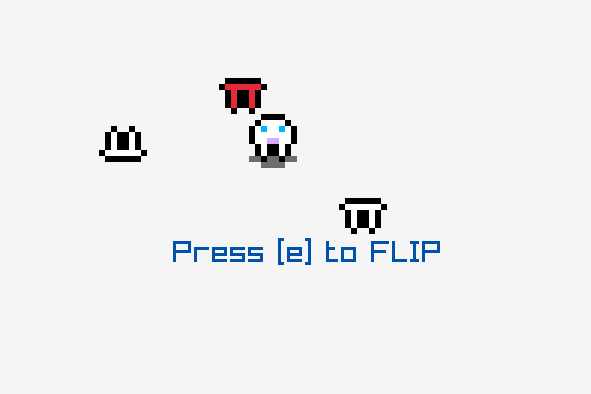

# Second
This game is called *Second*, as this is the second project I have created the other day.
It is being written in C/C++ wiht RayLib as a framework as OpenGL is a mess, that I am not willing to learn.
Raylib is awesome.

## Code & Build System
The code & build system are inspired by [Ooga Booga](https://github.com/alpinestudios/oogabooga). 
No Cmake, no `make` or other nonesense. All is needed is `g++`.

The code also does not use .h nor .hpp files (exept for raylib integration). This simplifies and masivelly
speeds up writing, as there is no need to jump around files while you want to do trivial things (such
as adding an argument to a function). This change alone made coding much more enjoyable. We shall see how 
it works out ~~when~~ *if* the project grows.

Currently it is only build under x64 Linux. Windows version is planned in the future.

## Experimets
The project is meant to test different strategies (some of which may be considered bad-practice), and 
mess and fails are possible (probable) outcomes. Things that I consider experiments by now:
- oogabooga build system
- code grouping (fewer files with more code)1

1 This is meant to speed up development, as searching and navigating in the bounds of a single
[big] file is far easier and faster than when spanning multiple source files.

